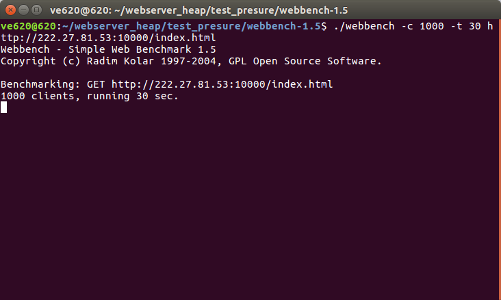

# C++ Proactor Web Server
## Version1.0
### 编译
```shell
git clone https://github.com/alwayskai/WebServer_version_1.0.git
cd WebServer_version_1.0/bin
./MyWebServer 10000

然后打开地址栏输入 127.0.0.1:10000/index.html
```
### 架构


点击查看大图

 ### HTTP请求解析流程


### 源码
详细的源码讲解请看注释


### 特性

```
1. 在整个epoll监听循环开始之前 先屏蔽掉SIGPIPE信号

		//默认读写一个关闭的socket会触发sigpipe信号 该信号的默认操作是关闭进程 这明显是我们不想要的
        //所以我们需要重新设置sigpipe的信号回调操作函数   比如忽略操作等  使得我们可以防止调用它的默认操作 
        //信号的处理是异步操作 也就是说 在这一条语句以后继续往下执行中如果碰到信号依旧会调用信号的回调处理函数
		//处理sigpipe信号
```

```
2.用setsockopt( listenfd, SOL_SOCKET, SO_REUSEADDR, &reuse, sizeof( reuse ) )消除bind时"Address already in use"错误
即设置SO_REUSEADDR 重用本地地址
```

```
3. epoll监管套接字的时候用边沿触发+EPOLLONESHOT+非阻塞IO
```

```
4. 使用多线程充分利用多核CPU，并使用线程池避免线程频繁创建销毁的开销
创建一个线程池  线程池中主要包含任务队列 和工作线程集合  使用了一个固定线程数的工作线程
工作线程之间对任务队列的竞争采用信号量和互斥锁结合使用
一个工作线程先加互斥锁 当任务队列中任务数量为0时候 阻塞在sem_wait()
当任务数量大于0时候 用信号量通知阻塞在sem_wait()的线程 这些线程来继续竞争获取任务
对任务队列中任务的调度采用先来先服务算法
```
```
5.采用Proactor模式 工作线程仅仅负责业务逻辑
```

```
6.实现了一个最小堆的定时器及时剔除超时请求
```
### 性能
用webbench压测工具
并发1000个请求 压测30s 用get请求 对server进行压测


